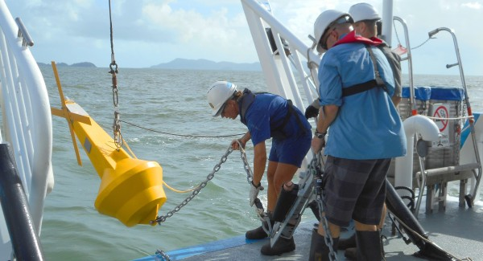

```{r setup, include=FALSE}
knitr::opts_chunk$set(echo = TRUE)
```

# Preparations

Load the necessary libraries

```{r libraries, results='markdown', eval=TRUE, warning=TRUE, message=FALSE}
library(mgcv)      #for GAMs
library(gratia)    #for GAM plots
library(emmeans)   #for marginal means etc
library(broom)     #for tidy output
library(MuMIn)     #for model selection and AICc
library(lubridate) #for processing dates
library(tidyverse) #for data wrangling
library(DHARMa)    #for residuals diagnostics
```
 
# Scenario

The Australian Institute of Marine Science (AIMS) have a long-term
inshore marine water quality monitoring program in which water samples
are collected and analysed from sites across the GBR numerous times 
per year.  The focus of this program is to report long-term condition and change
in water quality parameters.

{width="251" height="290"}

Format of aims.wq.csv data file

LATITUDE LONGITUDE reef.alias Water_Samples Region Subregion Season waterYear NOx
-------- --------- ---------- ------------- ------ --------- ------ --------- ---
-16.1    145.      Cape Trib… AIMS          Wet T… Barron D… Dry    2008      0.830
-16.1    145.      Cape Trib… AIMS          Wet T… Barron D… Wet    2008      0.100
-16.1    145.      Cape Trib… AIMS          Wet T… Barron D… Dry    2009      0.282
-16.1    145.      Cape Trib… AIMS          Wet T… Barron D… Wet    2009      1.27
-16.1    145.      Cape Trib… AIMS          Wet T… Barron D… Dry    2009      0.793
-16.1    145.      Cape Trib… AIMS          Wet T… Barron D… Dry    2010      0.380
\...     \...      \...       \...          \...   \...      \...   \...      \...

--------------     ---------------------------------------------------------------------
**LATITUDE**       - Latitudinal coordinate
**LONGITUDE**      - Longitudinal coordinate
**reef.alias**     - Internal AIMS reef name
**Water_Samples**  - Categorical label of who collected the data
**Region**         - The MMP region
**Subregion**      - The MMP subregion
**Season**         - A categorical listing of Wet or Dry
**waterYear**      - The water year (1st Oct - 30 Sept) to which the data are attached
**NOx**            - Nitrite and Nitrate
--------------     ---------------------------------------------------------------------

# Read in the data

```{r readData, results='markdown', eval=TRUE}
wq = read_csv('../data/aims.wq.csv', trim_ws=TRUE)
glimpse(wq)
```

```{r prepareData, results='markdown', eval=TRUE}
# define categorical variables as factors:
wq = wq %>% mutate(reef.alias=factor(reef.alias),
                   Region=factor(Region),
                   Subregion=factor(Subregion),
                   Season=factor(Season))
```

now, NOx (our response variable) cannot be <0, so a Gamma or log Normal model would be appropriate to try

# Exploratory data analysis

Model formula:
$$
y_i \sim{} \mathcal{N}(\mu_i, \sigma^2)\\
\mu_i =\beta_0 + f(Date_i) + f(Month_i)
$$

where $\beta_0$ is the y-intercept. $f(Date)$ and $f(Month)$ indicate the additive smoothing functions of the long-term temporal trends and the annual seasonal trends respectively. 

```{r exploratory scatter plot}
ggplot(wq,aes(x=Date,y=NOx))+
  geom_point()+
  facet_wrap(~reef.alias) 
```
```{r exploratory scatter plot on log scale}
# since we're going to use a Gamma or log Normal - how about we have a look at the data on a log scale to see if the patterns are linear or nonlinear:
ggplot(wq,aes(x=Date,y=NOx))+
  geom_point()+
  geom_smooth()+
  scale_y_log10()+
  facet_wrap(~reef.alias,scales='free_y')
# here we can see the trends are not linear, so we want to fit a spline or a gam to model the data
```
```{r maniuplate date data}
wq <- wq %>% mutate(Dt.num=decimal_date(Date)) # turns date into a decimal - computationally easier/quicker to deal with
head(wq)
colnames(wq)
```

# Simple model (Pandora only)
```{r}
# let's start by just looking at Pandora reef - keep things simple
wq.pandora <- filter(wq,reef.alias=='Pandora',!is.na(NOx))
ggplot(wq.pandora,aes(x=Date,y=NOx))+geom_point()+geom_smooth()+scale_y_log10()
```
## Fit some models
```{r fit a few different models to determine which one would be most appropriate for the data}
wq.gam <- gam(NOx~s(Dt.num),data=wq.pandora,family='gaussian',method='REML')
wq.gam1 <- gam(NOx~s(Dt.num),data=wq.pandora,family=gaussian(link='log'),method='REML')
wq.gam2 <- gam(NOx~s(Dt.num),data=wq.pandora,family=Gamma(link='log'),method='REML')
wq.gam3 <- gam(NOx~s(Dt.num),data=wq.pandora,family=tw(link='log'),method='REML') # here's a new distribution that's sort of half-way between a Gamma and a Poisson - a 'tweedie'

# now compare the models by looking at thei AICc values 
AICc(wq.gam,wq.gam1,wq.gam2,wq.gam3) # the best one is wq.gam2 (lowest AICc value) - this is the Gamma model
```

## Model validation
```{r validate the best model - AICc identified the Gamma model as the best one}
k.check(wq.gam2) # yep looks ok
```

```{r check out our diagnostic graphs}
appraise(wq.gam2) # residual plot doesn't look great, but QQ normal plot looks good
```
```{r show partial plots - check out the residuals }
draw(wq.gam2,residuals=TRUE)
```
## Model investigation / hypothesis testing
```{r test for overdispersion}
# what about the simulated residuals?
wq.resid <- simulateResiduals(wq.gam2,plot=TRUE)
# QQ normal plot looks ok, residuals plot have some trend, sort of ok...
```
```{r fit a model that smooths separately for each season}
# with gams, can ask for different smoother for different categories e.g. in this case we could smooth for the wet season, and smooth for the dry season separately
wq.gam2a <- gam(NOx~s(Dt.num,by=Season),data=wq.pandora,family=Gamma(link='log'),method='REML')
draw(wq.gam2a) # show partial plots for Wet & Dry seasons 

#splines have to be additive - but by using 'by' you can account for interaction
```
```{r now fit a model that uses cyclical basis functions}
wq.gam3 <- gam(NOx~s(Dt.num)+s(Mnth,bs='cc',k=5), # 'cc' - cyclical regression - start & finish must be the same value
               knots=list(Mnth=seq(1,12,length=5)),
               data=wq.pandora,family=Gamma(link='log'),
               method='REML')

# Mnth is a variable in the dataset - month that the sample was collected in - Mnth therefore represents a within year pattern
```

```{r validate new model}
k.check(wq.gam3)
```
```{r}
summary(wq.gam3)
# evidence for significant wiggliness both from year to year and within year too
draw(wq.gam3) # show partial plots - can see long-term trend in NOx from year to year, and then the trend within each year
```
## Now let's look at all the reefs that have long-term data sets (let's get rid of reefs that only have short datasets)
```{r}
# we do this by filtering the original dataset - filter by a date requirement
reef <- wq %>% 
  group_by(reef.alias) %>% # calculate separately for each reef
  summarise(Min=min(Dt.num)) %>%  # what is the minimum date for each reef i.e. when did monitoring start for each reef?
  filter(Min<2012) %>% # filter so that our new dataset excludes reefs that only started monitoring after 2012  
  pull(reef.alias) 

wq <- wq %>% filter(reef.alias %in% reef) %>% droplevels() # %in% means any reef.alias that's in the reef dataset

# let's just check by having another look at out plot 
ggplot(wq,aes(x=Dt.num,y=NOx))+geom_point()+facet_wrap(~reef.alias)
```
## Mixed model (all reefs)
```{r fit a mixed effects gam because we have a blocking design}
# here we have a blocking design so we need to fit a mixed effects model
# so we fit a generalised additive mixed effects model - a gamm

wq.gamm <-gamm(NOx~s(Dt.num),random=list(reef.alias=~1),
               data=wq,family=Gamma(link='log'),method='REML') # NOT recommended to do a GAM mixed effects model this way - because this estimates the model iteratively 

# fit a mixed effects GAM model THIS way:
wq.gamm1 <- gam(NOx~s(Dt.num)+s(reef.alias,bs='re'),
                data=wq,
                family=Gamma(link='log'),
                method='REML')
```
```{r validate the mixed effects GAM}
k.check(wq.gamm1) 
appraise(wq.gamm1) # eeek doesn't look great these plots....
# so, why don't we go and add Mnth to this
```
## Fit another model
```{r fit mixed effects GAM including  a smoother for month}
wq.gamm2 <- gam(NOx~s(Dt.num,k=20)+
                  s(Mnth,bs='cc',k=5)+
                  s(reef.alias,bs='re'),
                knots=list(Mnth=seq(1,12,length=5)),
                family=Gamma(link='log'),
                             data=wq,
                             method='REML')
```
## Validate new model
```{r validate model}
k.check(wq.gamm2)
```
```{r plot partial plots}
draw(wq.gamm2)
```
## Summarise model
```{r summarise mixed effects GAM model smoother for Dt.num & Mnth}
summary(wq.gamm2)
# this shows the there is significant wiggliness in Dt.num & Mnth
```
```{r}
tidy(wq.gamm2) %>% kable()
```
## Predictions & Summary figures

```{r make some predictions}
wq.list <- with(wq,list(Dt.num=seq(min(Dt.num),max(Dt.num),len=100))) # make a list of possible x values to predict from
wq.newdata <- emmeans(wq.gamm2,~Dt.num,at=wq.list,type='response',
                      data=wq.gamm2$model) %>% as.data.frame() # calculate predictions for average month & average reef

```

```{r plot your predictions}
ggplot(wq.newdata,aes(x=date_decimal(Dt.num),y=response))+
  geom_ribbon(aes(ymin=lower.CL,ymax=upper.CL),fill='magenta3',alpha=0.3)+
  geom_point()+
  scale_x_datetime('')+
  theme_bw()
```


