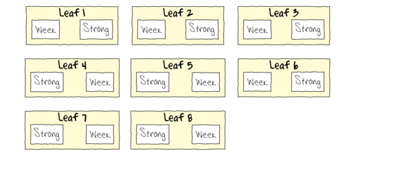

```{r setup, include=FALSE, warnings=FALSE, message=FALSE}
knitr::opts_chunk$set(echo = TRUE)
```

# Preparations

Load the necessary libraries

```{r libraries, results='markdown', eval=TRUE, message=FALSE, warning=FALSE}
library(car)       #for regression diagnostics
library(broom)     #for tidy output
library(broom.mixed)
library(ggfortify) #for model diagnostics
library(sjPlot)    #for outputs
library(knitr)     #for kable
library(effects)   #for partial effects plots
library(emmeans)   #for estimating marginal means
library(MASS)      #for glm.nb
library(MuMIn)     #for AICc
library(tidyverse) #for data wrangling
library(nlme)
library(lme4)      #for lmer
library(lmerTest)  #for satterthwaite p-values with lmer
library(DHARMa)
library(glmmTMB)
#library(pbkrtest)  #for kenward-roger p-values with lmer
```

# Scenario

A plant pathologist wanted to examine the effects of two different strengths of tobacco virus on the number of lesions on tobacco leaves.  She knew from pilot studies that leaves were inherently very variable in response to the virus.  In an attempt to account for this leaf to leaf variability, both treatments were applied to each leaf.  Eight individual leaves were divided in half, with half of each leaf inoculated with weak strength virus and the other half inoculated with strong virus.  So the leaves were blocks and each treatment was represented once in each block.  A completely randomised design would have had 16 leaves, with 8 whole leaves randomly allocated to each treatment.  

{height="300"}



Format of tobacco.csv data files

LEAF   TREAT    NUMBER
------ -------- --------
1      Strong   35.898
1      Week     25.02
2      Strong   34.118
2      Week     23.167
3      Strong   35.702
3      Week     24.122
\...   \...     \...

------------ ----------------------------------------------------------------------------------------------------
**LEAF**     The blocking factor - Factor B
**TREAT**    Categorical representation of the strength of the tobacco virus - main factor of interest Factor A
**NUMBER**   Number of lesions on that part of the tobacco leaf - response variable
------------ ----------------------------------------------------------------------------------------------------


# Read in the data

```{r readData, results='markdown', eval=TRUE}
tobacco = read_csv('../data/tobacco.csv', trim_ws=TRUE)
glimpse(tobacco)

# this is a hierarchical  model
# each leaf (BLOCK) has the 2 different treatments (TREATMENT) applied randomly (to minimise systematic bias)

# NB remember good idea to declare categorical data:
tobacco <- mutate(tobacco,TREATMENT=factor(TREATMENT),LEAF=factor(LEAF)) # great! now all our categorical variables are factors (as opposed to characters)
```

# Exploratory data analysis

```{r boxplot}
# if this was jut a simple t-test we'd do a box plot - easy! let's a have a quick look why not!:
ggplot(tobacco,aes(y=NUMBER,x=TREATMENT)) +
  geom_boxplot()

# based on this, the data looks approximately normal, so Gaussian distribution might be appropriate, a Gamma (can't have zeros though remember) would be ok as well - these are our 2 obvious candidates

# so let's go ahead with a Gaussian as a linear mixed effects model

# get a feel for the data & what you might expect
ggplot(tobacco,aes(y=NUMBER,x=as.numeric(LEAF))) +
  geom_line(aes(linetype=TREATMENT))

```
3 packages for linear mixed effects models:

package -> function

nlme  -> lme (assumes Gaussian - can't do generalised mixed effects) - the old model
lme4 -> lmer, glmer (newer model - some models that these won't fit, but can deal with generalised linear models, doesn't give p values)
glmmTMB -> glmmTMB (mixed effects & generalised mixed effects models - this one has the broadest scope)

Model formula:
$$
y_i \sim{} \mathcal{N}(\mu_i, \sigma^2)\\
\mu_i =\boldsymbol{\beta} \bf{X_i} + \boldsymbol{\gamma} \bf{Z_i}
$$

where $\boldsymbol{\beta}$ and $\boldsymbol{\gamma}$ are vectors of the fixed and random effects parameters respectively 
and $\bf{X}$ is the  model matrix representing the overall intercept and effects of the treatment on the number of lesions.
$\bf{Z}$ represents a cell means model matrix for the random intercepts associated with leaves.

# Fit the model
```{r fit model}
library(lme4)
#tobbaco_glmmTMB <- glmmTMB(NUMBER~TREATMENT+(1|LEAF),data=tobacco,REML=TRUE) # this isn't working..
tobbaco_lmer <- lmer(NUMBER~TREATMENT+(1|LEAF),data=tobacco,REML=TRUE) # use this for now
# repsonse is number, the predictor is treatment, the (1|LEAF) are the random effects - put them in the +() bit - the | means conditional on, 1 refers to the intercept: this is saying is the intercept should be conditional on the leaf - each leaf has its own intercept - it's like saying the baseline differs for each leaf & it also recognises that it's a random effect so it doesn't provide estimates it will just tell you the variance in the intercepts - it will also come up with an average effect across all leaves 

# so for me it would give average effect of macoralgal removal treatment across all plots 

# can have random intercept, or random intercept & slope (do this is you have all the raw data, i.e. you didn't average the pseudoreplicates first)

# REML - using maximum likelihood- but it's known to be biased, so we use restricted maximum likelihood which isn't as biased a.k.a residual maximum likelihood- it's maximising the likelihood of the residuals rather than the observations

# NB: want model to run with REML because it's less biased BUT if you want to compare 2 models that are different only in their fixed structure (so what fixed factors they include) you can only do so if you're using maximum likelihood NOT restricted maximum likelihood
```

# Model validation 
```{r validate model, warning=FALSE, message=FALSE}
plot_grid(plot_model(tobbaco_lmer, type='diag')[-2])

# the second plot it would normally produce is misformed & makes the whole thing fail, so the [-2] says don't plot the second plot, otherwise the whole this will fail

# our graphs tell us this:
# A: QQ normal plot - looks good, roughly a straight line
# B: density plot of the residuals - yep looks pretty normally distributed
# C: residual plot - looks pretty ok - random scatter

# this is great!

# we don't look at things like overdispersion because we're assuming Gaussian distribution which assumes mean & variance are equal so the variance is set, it is not estimated, so there can't be overdispersion

# can't have autocorrelation when you only have 2 levels of a factor - need to have at least 3 things, or really 5
```

# Model investigation / hypothesis testing
```{r}
summary(tobbaco_lmer)

# what do we get from this?

# Random effects:
# partitioning variance of effects into different parts of the hierarchy i.e. what was the variance b/w the baselines/intercepts for each leaf? 13.63 units of variance - dependent on scale of data - but when you compare to residuals you can see there's as much noise between leaves as there is between treatments within the leaves - indicates scale of variability

# Fixed factors:
# intercept represents average of the first group (STRONG)
# then the WEAK group have on average 7.9 fewer lesions and that difference is significant

```

```{r tidy summary}
tidy(tobbaco_lmer,conf.int=TRUE) # & can pipe to kable for a neat output
```
# Strength of relationship
```{r r squared value}
library(MuMIn)
r.squaredGLMM(tobbaco_lmer)
# R2c is the conditional r squared - fixed & random together - the model as a whole explains about 68% of the variability
# the strength of mixed effects is R2m
```

# Predictions & Summary figures
```{r use emmeans to create predictions plot}
emmeans(tobbaco_lmer, ~TREATMENT) %>% as.data.frame() %>% ggplot() + 
geom_pointrange(aes(y=emmean,x=TREATMENT,ymin=lower.CL,ymax=upper.CL))
```

# References
